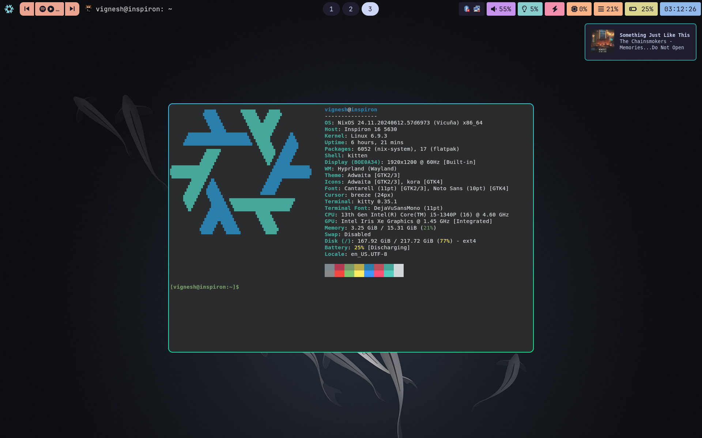

# dotfiles

These are my personal nixos system configuration files using flakes in constant development.
This is how it looks right now.

## Important Notes
- `distrobox` is best installed locally from their GitHub repo since the nixpkgs version mounts `/nix` in the containers which leads to problems.
